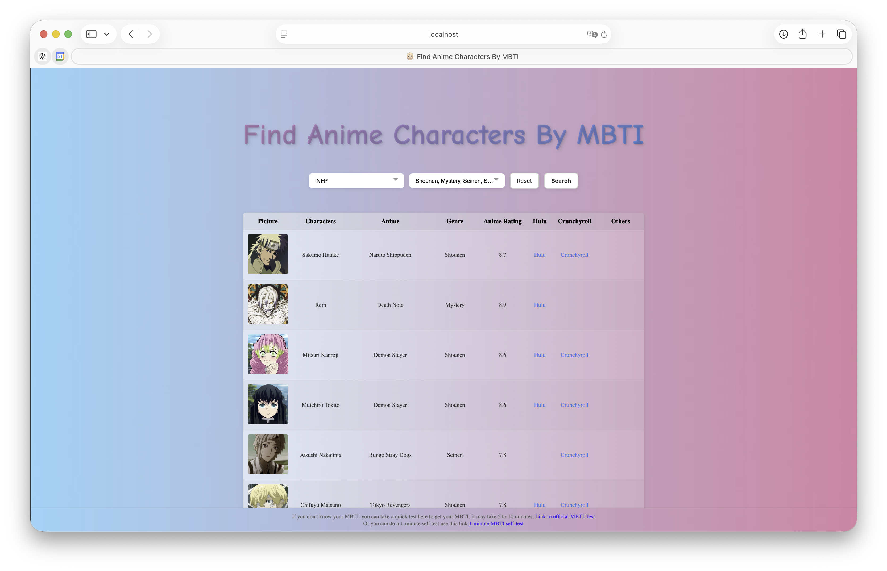

# Find Anime Characters Match Your MBTI

We create a website that can help you to find anime chatacters that share the same MBTI with you, which can help you to find anime to watch
or have a better understanding of yourself through knowing the anime characters that shares the same MBTI with you.



## How to use

### Dependency: Docker

1. Clone the repo

    ``` sh
    git clone git@github.com:brojyf/FindAnimeCharactersByMBTI-Group.git project
    ```

2. Change directory

    ```sh
    cd project
    ```

3. Build environment

    ```sh
    docker compose up -d
    ```

4. Open the following link in your browser  
    <http://localhost:3000>

## Link to MBTI Test

[Link to MBTI test](https://www.16personalities.com/?gad_source=1&gbraid=0AAAAACvYvISIRGYOo9EUBAQdzx9gtyEQI&gclid=Cj0KCQjw782_BhDjARIsABTv_JD7bZrb1DTRrpX3XHBZmCpxAM6zfRwRAFYL77sscdOI_j7RsrjDpSQaAl5bEALw_wcB)

## Dataset We Used

Our dataset comes from Kaggle [`Anime Characters Personality And Facial Images`](https://www.kaggle.com/datasets/tianyimasf/anime-characters?resource=download)

## License

Any form of commercial use, sale or integration into paid products requires prior authorization.

## Contributors

Patrick Jiang <brojyf@163.com>  
Shiori Nakayama<snakayama@plu.edu>
